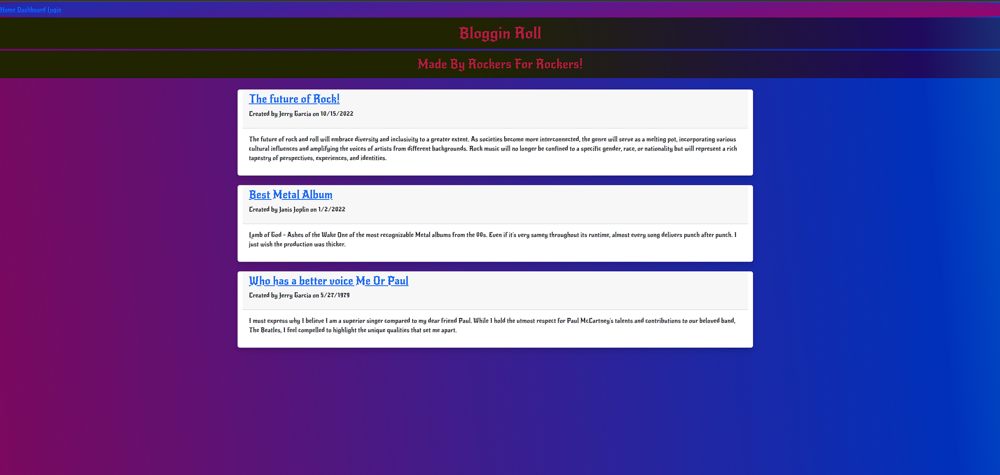
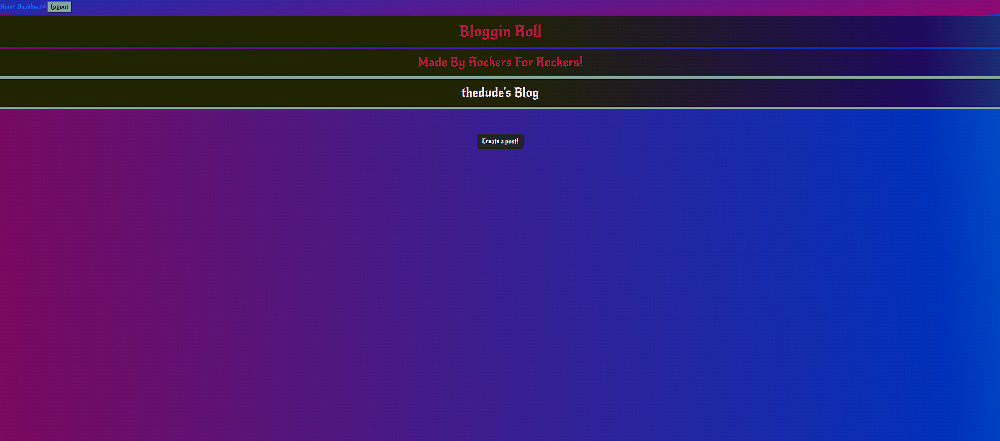
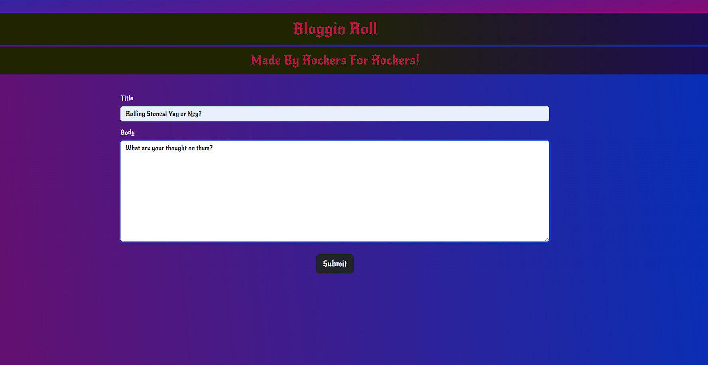
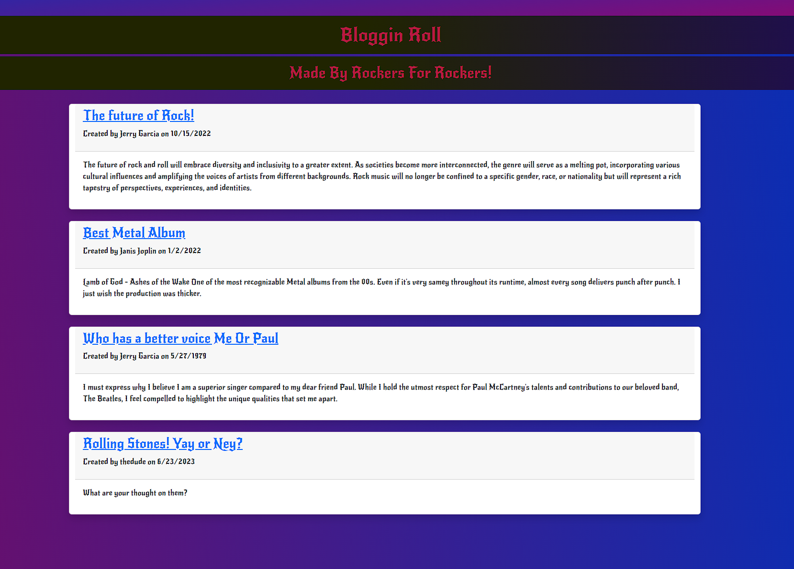
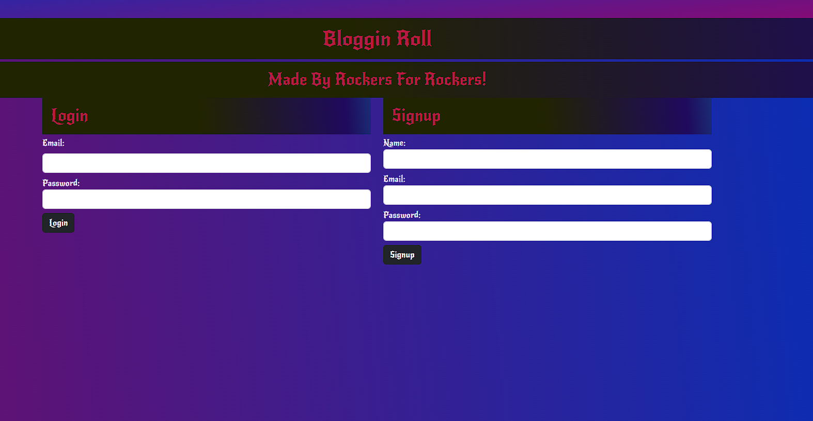

# Bloggin-Roll

 

## Table of Contents

- [Description](#description)

- [Screenshots](#screenshots)

- [Live-URL](#live-url)

- [Technologies-Used](#technologies-used)

- [Installation](#installation)

- [Credits](#credits)

- [Features](#features)

- [Usage-Information](#usage-information)

- [Suggested-Future-Development](#suggested-future-development)

- [Contribution-Guidelines](#contribution-guidelines)

- [Test-Instructions](#test-instructions)

- [License](#license)

- [Questions](#questions)

## Description📝

This full-stack application was developed so that users could come create and interact with content regarding the tech industry. The application gives users a space to store created content via the dashboard page, comment on other users posts, as well as edit and delete their own posts. When arriving to the homepage, users will be able to see all current posts without needing an account, however will be directed to login or create an account when trying to access the dashboard, or in trying to create or view specific posts. User authentication via session storage and cookies is utilized in the application and offers a secure profile through specific routing and page protection. Users passwords are hashed through the bcrypt dependency before being entered into the MySQL database giving additional safeguards to users.

## Screenshots📸

## Live URL📼

## Technologies Used✅

## Installation💾

1. Clone the repo

2. Open in VS Code. If you do not have VS code you must install it.

3. Using the terminal, install node.js v16. If you have homebrew, the command should look like the following (brew install node@16), however this may vary and the documentation should be consulted.

4. Once node.js v16 is installed, in the terminal, utilize the command npm init -y to initialize and create a package.json where project files will be stored.

5. Next, use the terminal to run the command npm i to install the dependencies associated with this application (developers may need to install dependencies directly from the command line).

   Commands to install each dependency:

   - Command for sequelize will be npm i sequelize
   - Command for mysql2 will be npm i mysql2
   - Command for express will be npm i express@4.18.2
   - Command for dotenv will be npm i dotenv
   - Command for bootstrap will be npm i bootstrap
   - Command for connect-session-sequelize will be npm i connect-session-sequelize
   - Command for express-handlebars will be npm i express-handlebars
   - Command for express-session will be npm i express-session
   

6. Next, you will need to make sure you have an added .env file within the root directory of your repository, within which you will pass your environmental variables specifying the database name, your MySQL username, and your MySQL password. This will need to be completed before running the application, and will allow the connection.js file to utilize your environmental variables keeping your sensitive information protected.

7. If you do not have a MySQL account, you will need to create one (see https://dev.mysql.com/doc/mysql-installation-excerpt/5.7/en/).

8. Once all dependencies are installed, you will need to create the database. To do this you will need to navigate to the directory db directory containing the schema.sql file. Once there, you will need to open up a MySQL shell using the command mysql -u root -p, where you will then be prompted to enter you password. Once your password is entered you will be in the MySQL shell.

9. Once in the MySQL shell you will then run the command source schema.sql. This will create the database.

10. Once the database has been created, you will then need to seed the database (this will also create the model structure for the tables within the database). To do this, navigate to the root directory and run the command npm run seed. This needs to be done from the root directory because the .env file lives within the root.

11. Once the database has been seeded, you will then be able to run the command npm start from the root directory to spin up the server. With nodemon installed, you will also be able to utilize the command npm run watch to keep the server spun up between code edits.

12. From there, you can utilize applications such as Insomnia to test the functionality of the routes within the program and make edits to both the front-end and back-end of the code base.

## Credits

Much of this application code followed The # 14 Model project from bootcamp.

## Usage Information

Users will interact with the site completely through the frontend UI. They will see a public facing feed, and a login button where they will be prompted to either login or create an account. From there navigation of the entire application can be conducted, and users can contribute and start creating content instantly.

## Contribution Guidelines

if you choose to do so open an issue and modify any changes you would like to see on a feature branch and wait for approval before merging to the main branch. Thank you.

## Test Instructions

N/A

## License

NOTICE: This application is covered under the MIT License

## Questions

Have additional questions? Click the links below to reach me through my GitHub account or Email address.

[Link to Github](https://github.com/RichMur84/Bloggin-Roll.git)

<a href="mailto:grizzlylbc1@gmail.com">grizzlylbc1@gmail.com</a>
